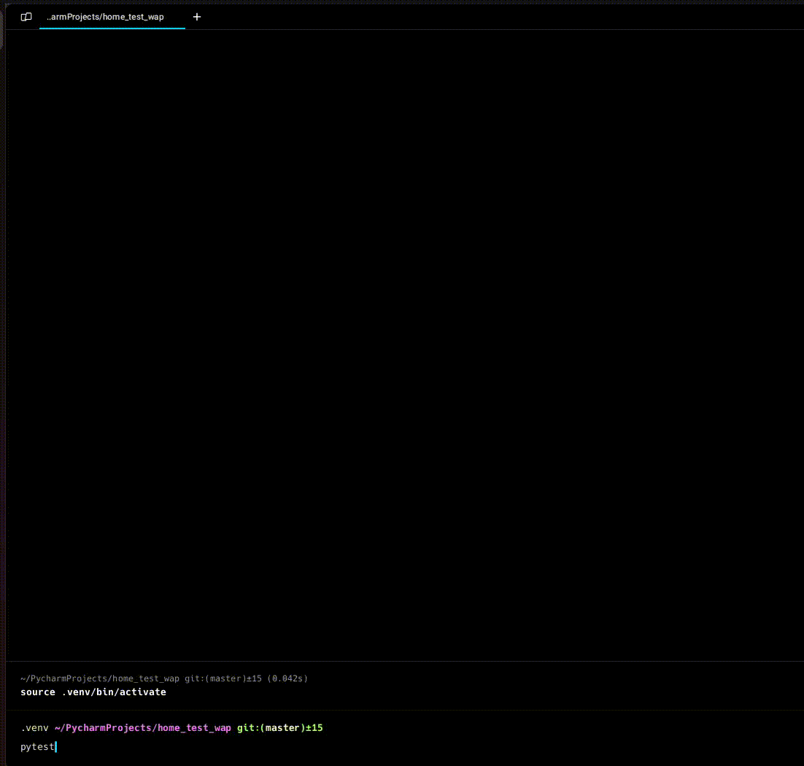

# Home Test WAP

This is a pytest test that uses Selenium.



## Running Tests

To execute the test, follow these steps:

1. Install dependencies, e.g. using:
```
pip install -r requirements.txt`
```
2. Execute the tests with the configured options:
```
pytest
```
Note: The `pyproject.toml` is pre-configured with pytest options to generate an HTML report.

## Project Structure

```
home-test-wap/
├── pages/
│   ├── __init__.py
│   ├── base_page.py
│   ├── category_page.py
│   ├── home_page.py
│   ├── search_page.py
│   └── streamer_page.py
├── tests/
│   ├── __init__.py
│   ├── conftest.py
│   └── test_twitch.py
├── utilities/
│   ├── __init__.py
│   └── helpers.py
├── screenshots/
│   └── # Automatically populated with screenshots upon test failures
├── .gitignore
├── pyproject.toml
├── README.md
├── requirements.txt
├── test_run.gif
```
Descriptions:

* **pages/**: Contains all Page Object classes representing different pages of the application.
* **tests/**: Houses test cases and the conftest.py for pytest fixtures and hooks.
* **utilities/**: Includes helper functions and utilities used across the test suite.
* **screenshots/**: Directory where screenshots are saved.
* **pyproject.toml**: Central configuration file for project metadata and tool configurations.
* **requirements.txt**: Lists project dependencies.
* **README.md**: Project documentation.
* **.gitignore**: Specifies files and directories to be ignored by Git.
* **test_run.gif**: Gif of the test running locally.
